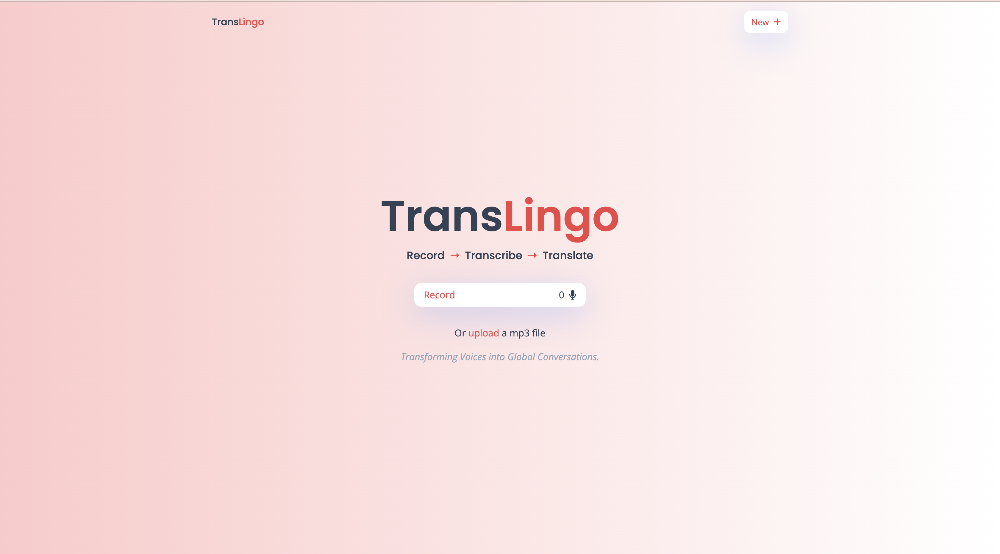
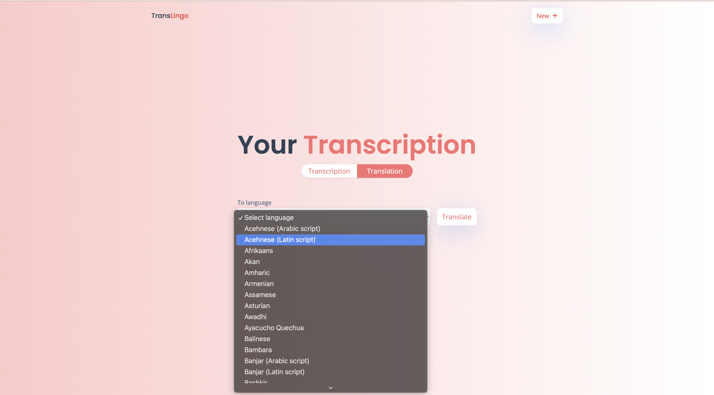

# Translingo 

Translingo is an advanced app for real-time language translation and transcription. It allows users to translate text and speech, transcribe audio, copy transcriptions, and download them. You can also choose from a variety of languages for translation.

## Features

- **Real-Time Translation:** Translate text and speech instantly.
- **Accurate Transcription:** Convert spoken language into text, with options to copy or download.
- **Language Selection:** Choose from a range of languages for translation.
- **Voice Recognition:** Supports voice input for hands-free use.
- **User-Friendly Interface:** Simple and intuitive design.

## Tech Stack

- **Frontend:** React.js
- **APIs:** OpenAI Whisper API, Xenova transformers (`Xenova/nllb-200-distilled-600M`)
- **Styling:** Tailwind CSS

## Live Link

Check out the live version of Translingo [here](https://main.d2jur9d8gyvg5.amplifyapp.com/).

## Screenshots

### Home Page



### Transcription Feature


### Translation Feature




## Installation

1. **Clone the repository:**
   ```bash
   git clone https://github.com/akhilmw/TransLingo.git
   ```
2. **Navigate to the project directory:**
    ```bash
    cd TransLingo
    ```
3. **Install the dependencies:**
    ```bash
    npm install
    ```
4. **To run the application locally:**
    ```bash
    npm run dev
    ```

## Contributing

1. Fork the repository.
2. Create your feature branch (`git checkout -b feature/fooBar`).
3. Commit your changes (`git commit -am 'Add some fooBar'`).
4. Push to the branch (`git push origin feature/fooBar`).
5. Create a new Pull Request.

## Acknowledgments

Thanks to [OpenAI](https://openai.com) and [Xenova](https://xenova.ai) for their APIs and tools.
